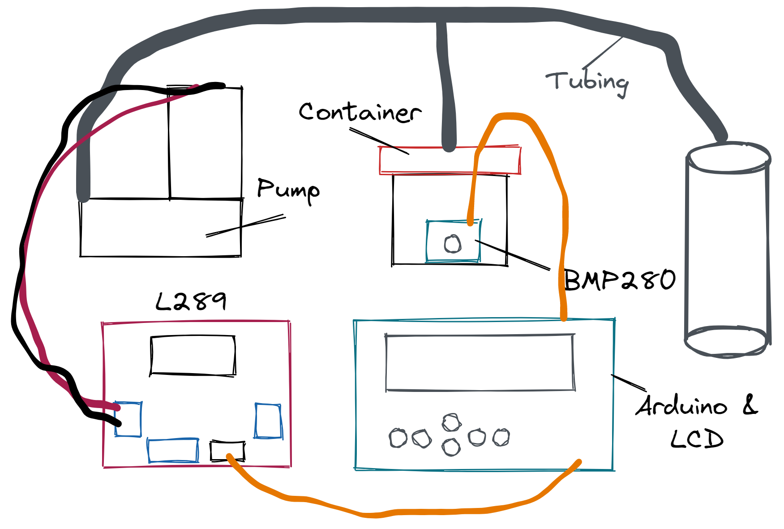

# Vacuum Pump Controller

Controller for a vacuum pump using an arduino.

## Hardware

The project was made using the following hardware

- [Arduinp Uno](https://store.arduino.cc/usa/arduino-uno-rev3)
- [L289N Motor Driver](https://www.amazon.com/Qunqi-Controller-Module-Stepper-Arduino/dp/B014KMHSW6/)
- [Arduino LCD KeyPad Shield](https://www.dfrobot.com/product-51.html)
- [BMP280 Pressure Sensor](https://www.adafruit.com/product/2651)
- 12VDC Vacuum Pump (commonly available on ebay)
- 1A 12VDC Power Supply
- Small Sealable Container (I used a small food container)

## Setup

The basic idea is to use the L289 motor driver to drive the vacuum pump. The 5v
output can also be used to drive the arduino + screen. The BMP280 is used to
sense the vacuum and speeds or slows down the motor to match the set level.
The sensor needs to be inside a sealed chamber connected to the tubing
going from the vacuum pump to the suction chamber. I used a small food
container which I then sealed with silicone (note: use a smaller quality
container. The cheaper/large ones will collapse under higher pressure.)

### Wiring

Connect the bmp280 as shown in the [i2c example](https://learn.adafruit.com/adafruit-bmp280-barometric-pressure-plus-temperature-sensor-breakout/arduino-test).
Connect the motor and L289 driver as shown in [Powering Arduino with L298NS](https://create.arduino.cc/projecthub/ryanchan/how-to-use-the-l298n-motor-driver-b124c5).
Finally simply plug the lcd shield on top of the arduino.

## Operation

The select button (leftmost button) is used to start/stop the pump. This is
true regardless of which menu is being shown. The left/right buttons are used
to choose which setting to adjust. The up/down buttons adjust the setting.
The top left of the screen shows the current pressure. The right of the screen
shows the time remaining in the interval (if any) and a counter that increases
for every interval.

### Settings

- Pressure: The vacuum level the pump should try to maintain (in inches mercury).
- Mode:
  - Constant - the pump will try to maintain constant pressure
  - Interval - the pump will alternate between trying to mantain constant
    pressure and off (on for interval time setting, off for pause time setting)
  - Int + Ramp - Same as interval except the pressure will be steadily increased
    during each interval.
  - Waves - the pressure will be increased/decreased by +1/-1 in hg every 10ss
- Interval Tm: How long the interval should run
- Pause Time: How long the pump should stay off after an interval
- Ramp Pres: The total amount to increase the pressure by in interval mode (eg pressure 2 and ramp pres 2 will result in a total of 4in hg)
- Ramp Time: How many intervals before reaching max pressure (eg a setting of 2
  means that for interval 1 the pressure will be increased up to 1/2 ramp press,
  and interval 2 will increase the remaining 1/2)

## Libraries

- [LiquidCrystal](https://www.arduino.cc/en/Reference/LiquidCrystal)
- [Adafruit BMP280 Driver](https://github.com/adafruit/Adafruit_BMP280_Library)
- [PID 1.2.0](https://github.com/br3ttb/Arduino-PID-Library/)
